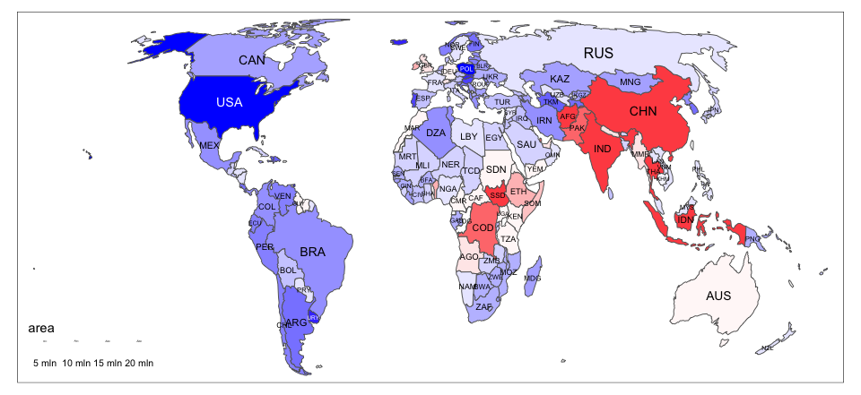
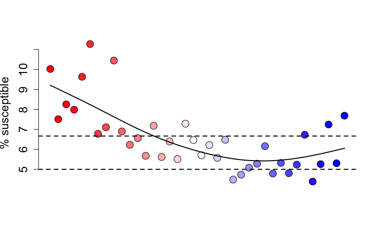
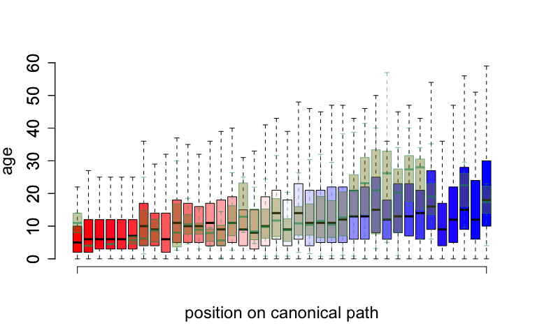
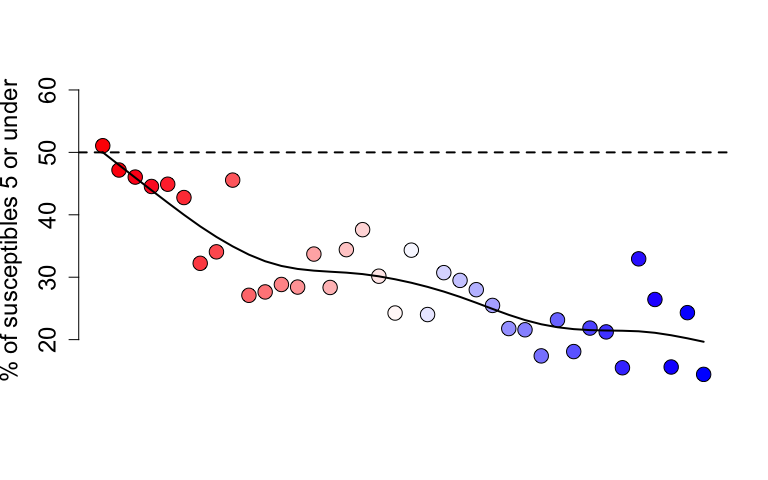
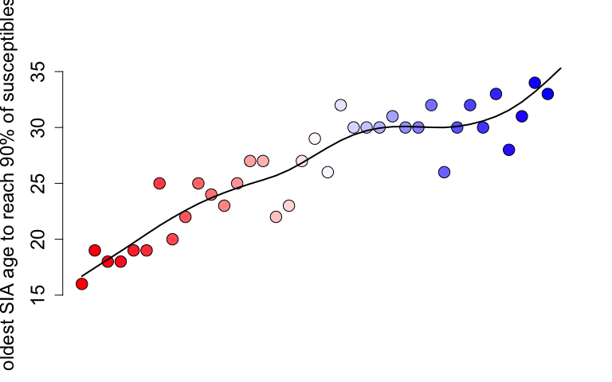
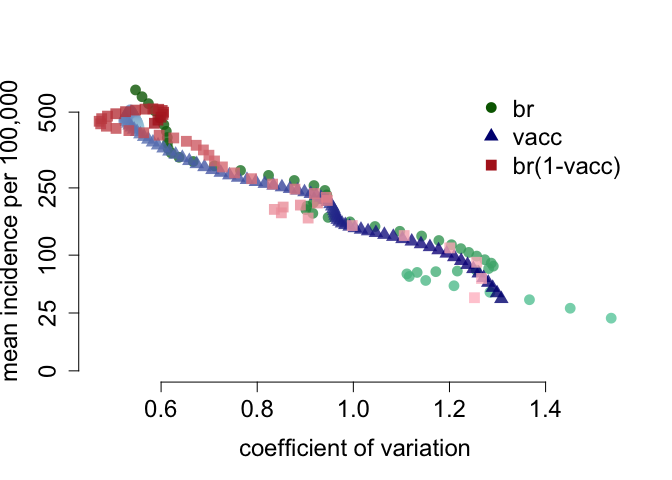

This notebook will construct the figures for the paper by Graham et al., titled "Measles and the Canonical Path to Elimination." First we weighted case data along with population data to construct a dataset which can be used to plot each country through time in 'incidence-space', which has the incidence on the y-axis, and the coefficient of variation of incidence over time on the x-axis.


Following the construction of this data set, we plot Figure 1A from the paper. This figure shows the position of
countries in the Americas and in Africa in two years, along with the mean path taken by these continents from 
the beginning of the data set to the end of it. These mean paths are shown by the green and purple lines in the
figure below, with the green line being for Africa and the purple one for the Americas.


<!-- -->

By combining the trajectories, we can create the canonical path towards elimination seen in Fig. 1B in the paper.
This figure was created in Adobe Illustrator, so cannot be reproduced here.

The canonical path seen in Fig. 2A is constructed by putting the incidence and coefficient of variation on the same scale (by multiplying the incidence by max(coefficient of variation) / max(incidence)) and then calculating the mean trajectories of Africa and the Americas over time, and combining these at the point that they intersect, i.e. at the point that the green and purple lines cross in the plot above.


<!-- -->

The analysis performed in the paper relies on the fact that when we calculate the position of a country at a given time in the incidence-space, we can calculate which point on the canonical path this country's location is closest to. However, we can see that when we do this there are positions which are close to each other distance wise on this path, but far in terms of progression towards elimination, due to the fact that on the lower end of incidence, there is very little distance between the points. For example if, in a given year, a country lay at the point 1.4 on the x-axis, and has a fairly low incidence, then it could easily be assigned to a point very close to the end of the path to elimination or one which is about half way along the path. This is not a desirable property of the canoncial path. To help distinguish the points more clearly, and help this assignment of nations, we do two things. Firstly, we take the log (natural base) of the incidence, and secondly, we transform both the incidence and the coefficient of variation data to be on the 0-1 scale. This is done in the chunk below.


When we plot the canonical path now, we see that there is a much greater distinction between points at the low incidence part of the path (figure not shown in the paper).  

<!-- -->

We can now assign countries to the closest point on this path each year that we have data for, using the re-scaled canonical path. This is seen in Fig. 3 in the paper, for 10 countries in Africa, the Americas and Europe. We also locate the positions on this path that the countries were at particular milestones in the attempt to control measles. These are the year of the first supplementary immunization activity (SIA), and the introduction of the second routine measles-containing vaccine (MCV2). 


This figure is reproduced here (for the paper, this was edited in Adobe Illustrator). Being at 0 on the x-axis scale of this figure indicates that the country is at the first point on the canonical path, and to be at 1 indicates that the country is at the final point on the path. The arrows show the progression of the country over time, with some of the countries heading backwards along the path. Countries do not necessarily progress smoothly along the path as if, for example, after years of low incidence is interrupted by a year of high incidence, then this will increase the x and y position of the country in incidence-space and hence the position on the canonical path will head backwards.

<!-- -->

This can be repeated for all countries, and hence for a given year a map can be produced which is colored according to each countries position along the path. This is seen below for 2014 (Fig. 2B of the paper).  We have also made available web application, developed with R package Shiny, to view all countries position on the canonical path between 1980 and 2014 (available at http://iddynamics.jhsph.edu/apps/shiny/measlescanonicalpath).


<!-- -->

Along with this analysis, we use a method for estimating the susceptibility in each year of age over time which was developed in @statespace. This method uses extended Kalman filter techniques to reconstruct the susceptibility of the population over time, given data on birth rate and vaccination rate, reported measles case data, along with knowledge of the dynamics of measles in the general population. This method will generate the number of susceptibles by age for each country and each year. For ease, we simply download the dataset already generated here.


We can then use the dataset of the number of susceptibles by country, year, and age, to link each country and year to the canonical path and determine the estimated proporiton of susceptibles at each canonical path point. 


Here we plot the proportion of susceptible individuals by canonical path point (Fig. 2C in the paper). The horizontal dashed lines display the critical level of immunity if the basic reproduction number of measles is 15 or 20 (critical level = 1-(1 / basic reproductive number)).

<!-- -->

We plot the age distribution of susceptibles by canonical path point 

<!-- -->

We also have data on the mean age of measles cases in multiple countries from 2000-2016. This data has increasing numbers of data as time goes on.


Again, these data can be linked to canonical path point. Here we make a boxplot of the esimated distribution of ages against the mean age of measles cases, to see how they compare (Fig. 2F). The estimates are colored the same colors as the canonical path points, and the case data is transparent yellow and green. 

<!-- -->


The figures below show the estimated proportion of susceptibles who are under 5 (Fig. 2D), and the age at which an SIA would have to go up to in order to cover 90% of all susceptibles (Fig. 2E).


<!-- --><!-- -->


# Supplementary 

Here we reproduce the figures seen in the supplement of the paper.  The following codes reproduces Fig. S1. 

<!-- -->

<!-- -->


<!-- -->

The following codes reproduces Fig. S2. 

<!-- -->


<!-- --><!-- -->


Figure S3 of the supplement has the location of countries in the WHO Africa and Americas Regions in incidence-space in 1990 and 2014 post scaling of incidence and CV. This is re-created here.


<!-- -->

We used an established discrete time age-structured mathematical model, introduced in @metcalf2012a and @metcalf2012b to simulate measles transmission dynamics for each country in the WHO Americas and Africa Regions.  We used the same gaussian weights as in the empirical analysis to create an incidence-space for each country over time, and compared this to estimates of measles incidence per @statespace and @simons2012.


```
## -------------------------------------------------------------------------
```

```
## You have loaded plyr after dplyr - this is likely to cause problems.
## If you need functions from both plyr and dplyr, please load plyr first, then dplyr:
## library(plyr); library(dplyr)
```

```
## -------------------------------------------------------------------------
```

```
## 
## Attaching package: 'plyr'
```

```
## The following objects are masked from 'package:dplyr':
## 
##     arrange, count, desc, failwith, id, mutate, rename, summarise,
##     summarize
```

```
## The following object is masked from 'package:purrr':
## 
##     compact
```

We plotted AFRO countries in incidence-space (Fig. S4A).

<!-- -->

We plotted AMRO countries in incidence-space (Fig. S4B).

<!-- -->

Figure S5 shows the trajectory of the Americas and Africa when we take the median of these regions paths rather than the mean.


<!-- -->


The estimated case data per @statespace and @simons2012 can also be used to plot a figure similar to figure 1 of the paper, demonstrating the path of the Americas and Africa through incidence space. This is seen below and is Fig S6.


<!-- -->

Figures S7 and S8, contains the results of modeling incidence and coefficient of variation as dependent variables separately, with birth rate, vacciation proportion and (birth rate) times (1-vacciantion proportion) all used independent variables (one at a time) using generalized additivie models (GAM). The only difference is that Fig. S7 uses reported cases, and Fig. S8 uses cases corrected for under-reporting. The term (birth rate) times (1-vaccination proportion) is an approximation of how quickly individuals who are susceptible to measles are recruited into the population, therefore we term this the rate of susceptible recruitment. To produce the GAM plots, we first need to construct a data set which has the estimated mean age of susceptibles by country and by year.


We can then plot these predicted paths in the incidence-space over values of birth rate, vaccination rate, and the rate of susceptible recruitment with reported cases (Fig. S7).

<!-- -->
   
    
<!-- -->

Figure S7 also displays the association between incidence or coefficient of variation with the birth rate and vaccination coverage in Africa.

<!-- -->

Similarly, we can use model incidence and coefficient of variation using GAMS, as seen above for the reported case data. This is seen below and Fig S8 of the paper.


<!-- -->
   
    
<!-- -->

Figure S9 shows the age distribution of cases in Malawi and Angola from 2006-2013. This figure is reproduced below.

<!-- -->


# References


