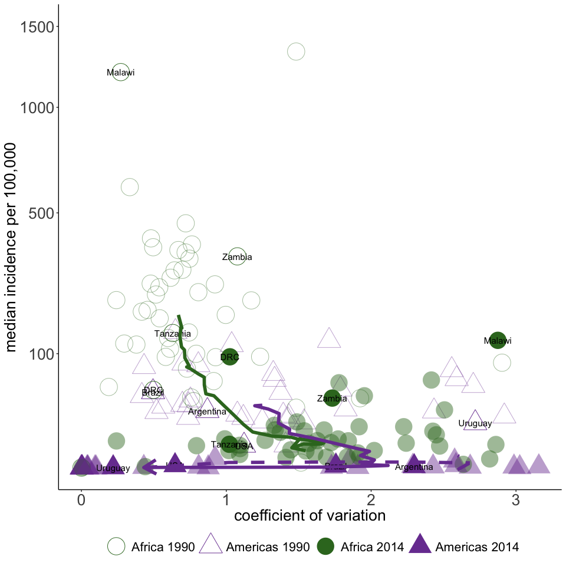

This notebook will construct the figures for the paper by Graham et al., titled "Measles and the Canonical Path to Elimination." First we weighted case data along with population data to construct a dataset which can be used to plot each country through time in 'incidence-space', which has the incidence on the y-axis, and the coefficient of variation of incidence over time on the x-axis.


Following the construction of this data set, we plot Figure 1A from the paper. This figure shows the position of
countries in the Americas and in Africa in two years, along with the mean path taken by these continents from 
the beginning of the data set to the end of it. These mean paths are shown by the green and purple lines in the
figure below, with the green line being for Africa and the purple one for the Americas.


<!-- -->

By combining the trajectories, we can create the canonical path towards elimination seen in Fig. 1B in the paper.
This figure was created in Adobe Illustrator, so cannot be reproduced here.

The canonical path seen in Fig. 2A is constructed by putting the incidence and coefficient of variation on the same scale (by multiplying the incidence by max(coefficient of variation) / max(incidence)) and then calculating the mean trajectories of Africa and the Americas over time, and combining these at the point that they intersect, i.e. at the point that the green and purple lines cross in the plot above.


<!-- -->

The analysis performed in the paper relies on the fact that when we calculate the position of a country at a given time in the incidence-space, we can calculate which point on the canonical path this country's location is closest to. However, we can see that when we do this there are positions which are close to each other distance wise on this path, but far in terms of progression towards elimination, due to the fact that on the lower end of incidence, there is very little distance between the points. For example if, in a given year, a country lay at the point 1.4 on the x-axis, and has a fairly low incidence, then it could easily be assigned to a point very close to the end of the path to elimination or one which is about half way along the path. This is not a desirable property of the canoncial path. To help distinguish the points more clearly, and help this assignment of nations, we do two things. Firstly, we take the log (natural base) of the incidence, and secondly, we transform both the incidence and the coefficient of variation data to be on the 0-1 scale. This is done in the chunk below.


When we plot the canonical path now, we see that there is a much greater distinction between points at the low incidence part of the path (Fig. S3 in the supplement).  

<!-- -->

We can now assign countries to the closest point on this path each year that we have data for, using the re-scaled canonical path. This is seen in Fig. 4A in the paper, where we plot all countries position on the path overtime, in addition to population-weighted region averages.  


<!-- -->

Countries do not necessarily progress smoothly along the path as if, for example, after years of low incidence is interrupted by a year of high incidence, then this will increase the x and y position of the country in incidence-space and hence the position on the canonical path will head backwards. We demonstrate these movements along the path by plotting the % change in path postion between 1990 and 2017 for each country in addition to population-weighted region averages, as see in Fig. 4B in the paper.

<!-- -->

Given our assignement of all countries to the closest point on the path, for any given year a map can be produced which is colored according to each countries position along the path. This is seen below for 2017 (Fig. 2C of the paper).  We have also made available web application, developed with R package Shiny, to view all countries position on the canonical path between 1980 and 2014 (available at http://iddynamics.jhsph.edu/apps/shiny/measlescanonicalpath/).


<!-- -->

We can also capture direction of movement of each country within the incidence space in order to assess "deviations" from the path or trajectories of countries in incidence space that were different than expected given the characterized canonical path.  Fig. 4C in the paper is reproduced here.  


We can plot the expected movement, observed movement, and difference for each region over 5 or 7 year increments.  The heat map captures the frequency of countries movement in a direction grouped by 10 degree angle groups.


```r
all.plots
```

```
## $reg1.year1
```

<!-- -->

```
## 
## $reg1.year2
```

<!-- -->

```
## 
## $reg1.year3
```

<!-- -->

```
## 
## $reg1.year4
```

<!-- -->

```
## 
## $reg1.year5
```

<!-- -->

```
## 
## $reg2.year1
```

<!-- -->

```
## 
## $reg2.year2
```

<!-- -->

```
## 
## $reg2.year3
```

<!-- -->

```
## 
## $reg2.year4
```

<!-- -->

```
## 
## $reg2.year5
```

<!-- -->

```
## 
## $reg3.year1
```

<!-- -->

```
## 
## $reg3.year2
```

<!-- -->

```
## 
## $reg3.year3
```

<!-- -->

```
## 
## $reg3.year4
```

<!-- -->

```
## 
## $reg3.year5
```

<!-- -->

```
## 
## $reg4.year1
```

<!-- -->

```
## 
## $reg4.year2
```

<!-- -->

```
## 
## $reg4.year3
```

<!-- -->

```
## 
## $reg4.year4
```

<!-- -->

```
## 
## $reg4.year5
```

<!-- -->

```
## 
## $reg5.year1
```

<!-- -->

```
## 
## $reg5.year2
```

<!-- -->

```
## 
## $reg5.year3
```

<!-- -->

```
## 
## $reg5.year4
```

<!-- -->

```
## 
## $reg5.year5
```

<!-- -->

```
## 
## $reg6.year1
```

<!-- -->

```
## 
## $reg6.year2
```

<!-- -->

```
## 
## $reg6.year3
```

<!-- -->

```
## 
## $reg6.year4
```

<!-- -->

```
## 
## $reg6.year5
```

<!-- -->

Along with this analysis, we used a method for estimating the susceptibility in each year of age which was developed by @tak2015. Each age cohort's susceptiblity is estimated based on its opportunity for immunization (via routine and supplmentary activities) and risk of natural infection. The probabliity of immunization was estimated per WHO reported administrative vaccination coverage estimates (@who). The probability of natural infection by age was estimated by assuming a constant hazard of infection over age that scaled each year relative to the proportional decline in estimated measles incidence corrected for under-reporting. Measles incidence, corrected for under-reporting, was estimated using a state space model per @statespace and @simons2012. The following chunks of code first uses the state-space model to estimate the number of measles cases (corrected for under-reporting) by year and country, then goes on to infer susceptibilty by age for each country and each year.


For ease, we can simply read in the already estimated proportion susceptible by age, year, and country.


We can then use the dataset of the number of susceptibles by country, year, and age, to link each country and year to the canonical path and determine the estimated total proporiton of susceptibles, and age-specific proportion susceptibles at each canonical path point. 


Here we plot the proportion of susceptible individuals by canonical path point (Fig. 2C in the paper). The horizontal dashed lines display the critical level of immunity if the basic reproduction number of measles is 15 or 20 (critical level = 1-(1 / basic reproductive number)).

<!-- -->

We plot the age distribution of susceptibles by canonical path point 

<!-- -->

We also have data on the mean age of measles cases in multiple countries from 2000-2016. This data has increasing numbers of data as time goes on.


Again, these data can be linked to canonical path point. Here we make a boxplot of the esimated distribution of ages against the mean age of measles cases, to see how they compare (Fig. 2F). The estimates are colored the same colors as the canonical path points, and the case data is transparent yellow and green. 

<!-- -->


The figures below show the estimated proportion of susceptibles who are under 5 (Fig. 2D), and the age at which an SIA would have to go up to in order to cover 90% of all susceptibles (Fig. 2E).


<!-- --><!-- --><!-- -->


# Supplementary 

Here we reproduce the figures seen in the supplement of the paper.  The following codes reproduces Fig. S1. 

<!-- -->

<!-- -->


<!-- -->

The following codes reproduces Fig. S2. 

<!-- -->


<!-- --><!-- -->


Figure S4 of the supplement has the location of countries in the WHO Africa and Americas Regions in incidence-space in 1990 and 2014 post scaling of incidence and CV. This is re-created here.


<!-- -->

Figure S5 shows the trajectory of the Americas and Africa when we take the median of these regions paths rather than the mean.


<!-- -->


We used an established discrete time age-structured mathematical model, introduced in @metcalf2012a and @metcalf2012b to simulate measles transmission dynamics for each country in the WHO Americas and Africa Regions.  We used the same gaussian weights as in the empirical analysis to create an incidence-space for each country over time, and compared this to estimates of measles incidence per @statespace and @simons2012.


```
## -------------------------------------------------------------------------
```

```
## You have loaded plyr after dplyr - this is likely to cause problems.
## If you need functions from both plyr and dplyr, please load plyr first, then dplyr:
## library(plyr); library(dplyr)
```

```
## -------------------------------------------------------------------------
```

```
## 
## Attaching package: 'plyr'
```

```
## The following objects are masked from 'package:dplyr':
## 
##     arrange, count, desc, failwith, id, mutate, rename, summarise,
##     summarize
```

```
## The following object is masked from 'package:purrr':
## 
##     compact
```

We plotted AFRO countries in incidence-space (Fig. S6A).

<!-- -->

We plotted AMRO countries in incidence-space (Fig. S6B).

<!-- -->


The estimated case data per @statespace and @simons2012 can also be used to plot a figure similar to figure 1 of the paper, demonstrating the path of the Americas and Africa through incidence space. This is seen below and is Fig. S7. The only difference is that Fig. 1A uses reported cases, and Fig. S7 uses cases corrected for under-reporting.


<!-- -->

Figure S8 demonstrates movement along the canonical path for 10 countries of interest from the Americas, Africa, and European.  These 10 countries are highlighted from Fig. 4A-B in the main text to conceptualize an individual country's movement on the path and discuss data biases or true dynamics that may have contributed to these movements.  

<!-- --><!-- -->

Figures S9 and S10, contains the results of modeling incidence and coefficient of variation as dependent variables separately, with birth rate, vaccination proportion and (birth rate) times (1-vacciantion proportion) all used independent variables (one at a time) using generalized additivie models (GAM). The term (birth rate) times (1-vaccination proportion) is an approximation of how quickly individuals who are susceptible to measles are recruited into the population, therefore we term this the rate of susceptible recruitment. To produce the GAM plots, we first need to construct a data set which has the estimated mean age of susceptibles by country and by year.


We can then plot these predicted paths in the incidence-space over values of birth rate, vaccination rate, and the rate of susceptible recruitment with reported cases (Fig. S9).

<!-- -->
   
    
<!-- -->

Figure S9C also displays the association between incidence or coefficient of variation with the birth rate and vaccination coverage in Africa.

<!-- -->

Similarly, we can use model incidence and coefficient of variation using GAMS, as seen above for the reported case data. This is seen below and Fig. S10 of the paper.


<!-- -->
   
    
<!-- -->

Figure S11 shows the age distribution of cases in Malawi and Angola from 2006-2013. This figure is reproduced below.

<!-- -->


# References


